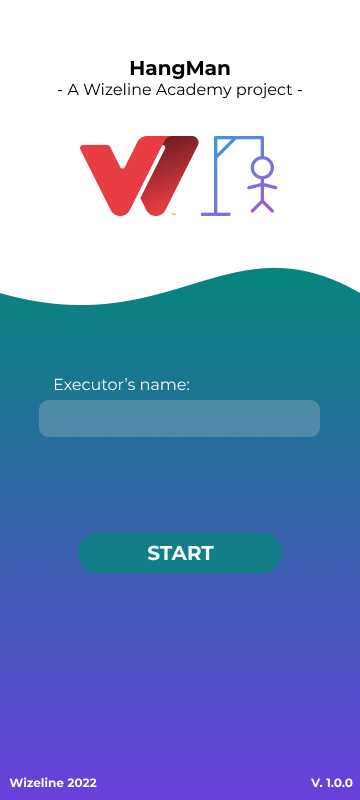
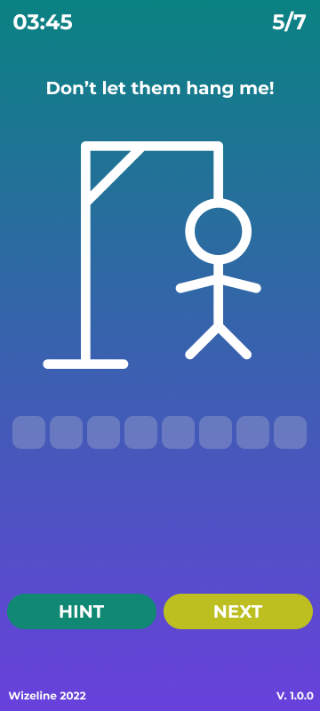
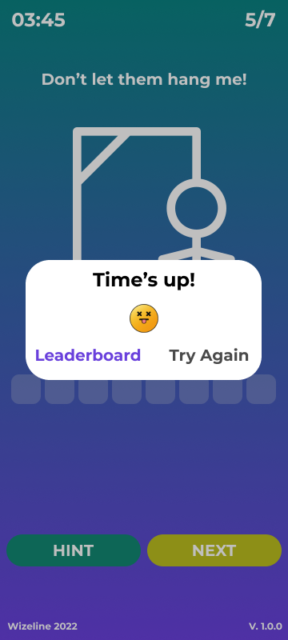
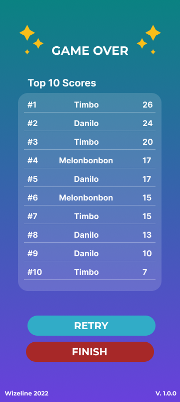

# Hangman

## Introduction

Thank you for participating in the RxJava and Coroutines bootcamp!

Here you will find instructions for completing the training.

## The Training

This challenge has been design to reinforce your knowledge and skills with
RxJava and Kotlin coroutines. The goal is to create a hangman app taking special care
on multithreading the tasks. In the following sections you will find the rules, requirements, api, and
instructions to get you started.

## Game rules and screens

### Rules

* The app starts in the home screen, where the player must enter their name
  (validate that the field is not empty).
* Game is over in any of the following situations:
    * The player has missed a word: Hangman painting is completed.
    * Time's up.
    * The player has correctly guessed all the words in the round.
* Score:
    * Total score increases by 25 with every correct char guess.
    * Total score decreases by 10 with every incorrect char guess.
    * Total score increases by remaining time * 10 at the end of the round.
* Saving scores
    * At the end of every round, the name of the player and the game have to be saved locally,
      so that the player can see top scores in the game over screen.

### Screens and components

You will build a hangman app with the following screens:

 &nbsp;  &nbsp;  &nbsp; 

* Hangman drawing:
    * Resets with every new word.
    * Updates with every incorrect guess: The player has 10 attempts to guess a word. You can find the images for every
      step in res/drawable/.
* Countdown timer:
    * Always shown on gameplay screen.
    * Updated every second.
    * Total time: 5 minutes.
* Score:
    * Always shown on gameplay screen.
    * Updated on every guess.
* Word count -> current word / total words in round:
    * Always shown in gameplay screen (at the top).
    * Updated when navigating to a new word.
    * Total words by round: 10.
* Hint button:
    * Completes the current word without giving points.
* Next button:
    * Only enabled when the word is completed either by guessing or hint button.
    * Navigates to next word.
    * If it is the last word in the round, changes to finish and navigates to game over screen.
* Game over screen:
    * Shows the name of the player and their score in the round.
    * Shows previous top scores.

## Where to fetch the words from?

In order to fetch the words for the hangman game, you will be working with
[themoviedb](https://developers.themoviedb.org/3/movies/get-popular-movies) API.

Fetch popular movies using the endpoint https://api.themoviedb.org/3/movie/popular and get the movie titles as the words
you will be including in your game.

In addition, in order to get random words on every round, you should pass a random page number as a query parameter to
the endpoint.

> **Note**: An API key is required to run the query. In order to get one, please follow this steps:
> 
> 1. Sign up in [https://www.themoviedb.org/signup](https://www.themoviedb.org/signup)
> 2. Click on you avatar or initials and go to settings.
> 3. Click on the "API" link in the left sidebar.
> 4. Click "Create" or "click here" under Request an API section.
>
> If you need more information, please go to the API
> documentation [here](https://developers.themoviedb.org/3/getting-started/introduction)

## Requirements

These are the main requirements we will evaluate:

- Fetch the words from the given API using RxJava.
- Store the records in a Room database, and show in the game over screen using Kotlin coroutines.
- Create unit tests in your Repository and ViewModel.
- Properly handle possible errors coming from the API.
- Use schedulers and dispatchers properly to move the work out of the main thread.

## Getting Started

To get started, follow these steps:

1. Clone this project
2. Make your project private
3. Grant your mentor access to the project
4. Commit periodically
5. Apply changes according to the mentor's comments
6. Have fun!

## Deliverables

You will share your final deliverable with your mentor via Pull Request. The deadline has been set to August 3rd, 2022.

## Documentation

### Self-Study Material

- [Retrofit](https://square.github.io/retrofit/)
- [GSON](https://github.com/google/gson)
- [ViewModel](https://developer.android.com/topic/libraries/architecture/viewmodel)
- [Navigation Component](https://developer.android.com/guide/navigation/navigation-getting-started)
- [RxJava](https://reactivex.io/documentation/operators.html)
- [RxAndroid](https://github.com/ReactiveX/RxAndroid)
- [Kotlin coroutines on Android](https://developer.android.com/kotlin/coroutines?gclid=CjwKCAjw2rmWBhB4EiwAiJ0mtdYgQY5bqjnFRuE1Z_89Y5yMqboQXt_E3-p8MdbDu9fzcJSHlbAmeRoCaIkQAvD_BwE&gclsrc=aw.ds)
